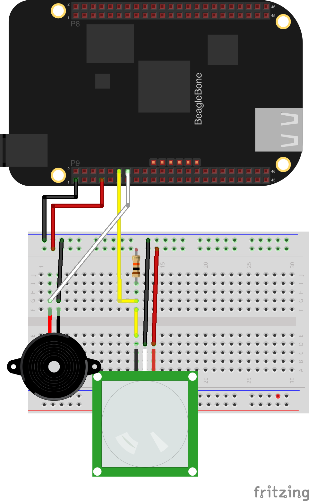

#The PIR motion detector

The PIR sensor is used to detect motion, and will be a critical sensor needed for our security system. We'll install
the driver for this sensor through npm, and wire up an app that will have our buzzer sound off when motion detected.

##Contents

1. Circuit
2. Retrieving Driver
3. Adding code to Server
4. Creating your first app
5. API and Browser

###Circuit

Here is a simple fritzing diagram of what your circuit will look like on the BeagleBone Black.



###Retrieving Driver

Again we'll use the npm command to install our driver. Type `npm install zetta-pir-bonescript-driver --save`. This will install our driver for us.


**TIP**: Ensure you install while on the BeagleBone operating system. The package
installation will fail if you use your native OS.

**TIP**: Every module you'll use in this tutorial is open source. This one can be found here https://github.com/zettajs/zetta-pir-bonescript-driver.

###Adding code to Server

Now it's time to actually wire up our Zetta driver into the server node. Below is a snippet we'll go through line by line.

```javascript
var zetta = require('zetta');
var Buzzer = require('zetta-buzzer-bonescript-driver');
var Microphone = require('zetta-microphone-bonescript-driver');
var PIR = require('zetta-pir-bonescript-driver');
var app = require('./apps/app');

zetta()
  .use(Buzzer)
  .use(Microphone)
  .use(PIR, 'P9_12')
  .load(app)
  .listen(1337)
```

* Here we've updated our code to let Zetta know that we want to use our PIR sensor to detect motion.
* We've passed in the exact pin on the BeagleBone Black that is required to work on the sensor. It's just additional arguments on the `use()` function.

###Updating your first app

Now we'll wire up our sound sensor into our app.

```javascript
module.exports = function(server) {
  var buzzerQuery = server.where({type: 'buzzer'});
  var pirQuery = server.where({type: 'pir'});
  var microphoneQuery = server.where({type: 'microphone'});

  server.observe([buzzerQuery, pirQuery, microphoneQuery], function(buzzer, pir, microphone){
    var microphoneReading = 0;

    microphone.streams.volume.on('data', function(msg){
      if (msg.data > 10) {
        if (pir.state === 'motion') {
          buzzer.call('turn-on', function() {});
        } else {
          buzzer.call('turn-off', function() {});
        }
      }
    });

    pir.on('no-motion', function() {
      buzzer.call('turn-off', function() {});
    });

  });
}
```

* We've updated our app code to include the new PIR device we've added.
* We'll now check for movement along with our sound code. If movement is detected we'll trigger the buzzer.

###API and Browser

Below is what a sample API response for your PIR module should look like. Only devices are exposed over the API by Zetta. Your apps are internal to your
IoT system.


```json
{
  "class": [
    "device"
  ],
  "properties": {
    "id": "b8622d08-8721-41f5-8ebc-706e17e8818a",
    "pin": "P9_12",
    "type": "pir",
    "name": "PIR Sensor",
    "state": "no-motion"
  },
  "actions": [
    {
      "name": "motion",
      "method": "POST",
      "href": "http://zetta-cloud-2.herokuapp.com/servers/38f645ed-73da-4742-8f20-c46317a48c19/devices/b8622d08-8721-41f5-8ebc-706e17e8818a",
      "fields": [
        {
          "name": "action",
          "type": "hidden",
          "value": "motion"
        }
      ]
    }
  ],
  "links": [
    {
      "rel": [
        "self"
      ],
      "href": "http://zetta-cloud-2.herokuapp.com/servers/38f645ed-73da-4742-8f20-c46317a48c19/devices/b8622d08-8721-41f5-8ebc-706e17e8818a"
    },
    {
      "title": "beaglebone",
      "rel": [
        "up",
        "http://rels.zettajs.io/server"
      ],
      "href": "http://zetta-cloud-2.herokuapp.com/servers/38f645ed-73da-4742-8f20-c46317a48c19"
    },
    {
      "title": "state",
      "rel": [
        "monitor",
        "http://rels.zettajs.io/object-stream"
      ],
      "href": "ws://zetta-cloud-2.herokuapp.com/servers/38f645ed-73da-4742-8f20-c46317a48c19/events?topic=pir%2Fb8622d08-8721-41f5-8ebc-706e17e8818a%2Fstate"
    },
    {
      "title": "logs",
      "rel": [
        "monitor",
        "http://rels.zettajs.io/object-stream"
      ],
      "href": "ws://zetta-cloud-2.herokuapp.com/servers/38f645ed-73da-4742-8f20-c46317a48c19/events?topic=pir%2Fb8622d08-8721-41f5-8ebc-706e17e8818a%2Flogs"
    }
  ]
}
```
