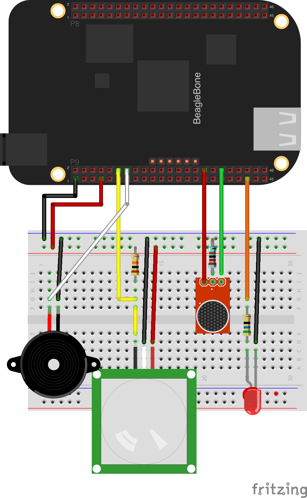

#Setting up your security system

The following documentation will guide you through how to build an IoT Security system using Zetta.

##Contents

1. Materials
2. Steps of the tutorial
  * [Piezo buzzer](../docs/PIEZO.md)
  * [Microphone sound detection](../docs/MICROPHONE.md)
  * [PIR motion detection](../docs/PIR.md)
  * [WeMo Actuator](../docs/WEMO.md)
  * [Writing a driver](../docs/DRIVERS.md)
  * [Next Steps](../docs/NEXTSTEPS.md)
3. Getting help
4. Glossary
5. Citations

###Materials

###Steps of the tutorial

The steps of the tutorial are broken out by component of the security system. It'll be important to follow the steps in order to ensure your
circuitry is built correctly, and fits properly on the breadboard.

1. [Piezo buzzer](../docs/PIEZO.md)
2. [Microphone sound detection](../docs/MICROPHONE.md)
3. [PIR motion detection](../docs/PIR.md)
4. [WeMo Actuator](../docs/WEMO.md)
5. [Writing a driver](../docs/DRIVERS.md)
6. [Next Steps](../docs/NEXTSTEPS.md)

###Getting Help

If you're going through this project, and run into an issue feel free to use these methods to reach out and contact us!

* matt@apigee.com
* https://groups.google.com/forum/#!forum/zetta-discuss
* https://github.com/zettajs/zetta/issues
* Reference Documentation: http://zettajs.github.io/

###Glossary

We may end up using some terms that are new to you. Here are their quick definitions and where to find out more about them.

* [Actuator](http://en.wikipedia.org/wiki/Actuator): a type of motor that is responsible for moving or controlling a mechanism or system.
* [Sensor](http://en.wikipedia.org/wiki/Sensor): a device that detects events or changes in quantities and provides a corresponding output.
* Driver: the Zetta representation of a device. It includes a Scout for finding the physical device, and a driver for interacting with the device via javascript.
* Scout: responsible for searching for a physical device, and alerting Zetta to it's existence.

### Final Hookup Diagram

