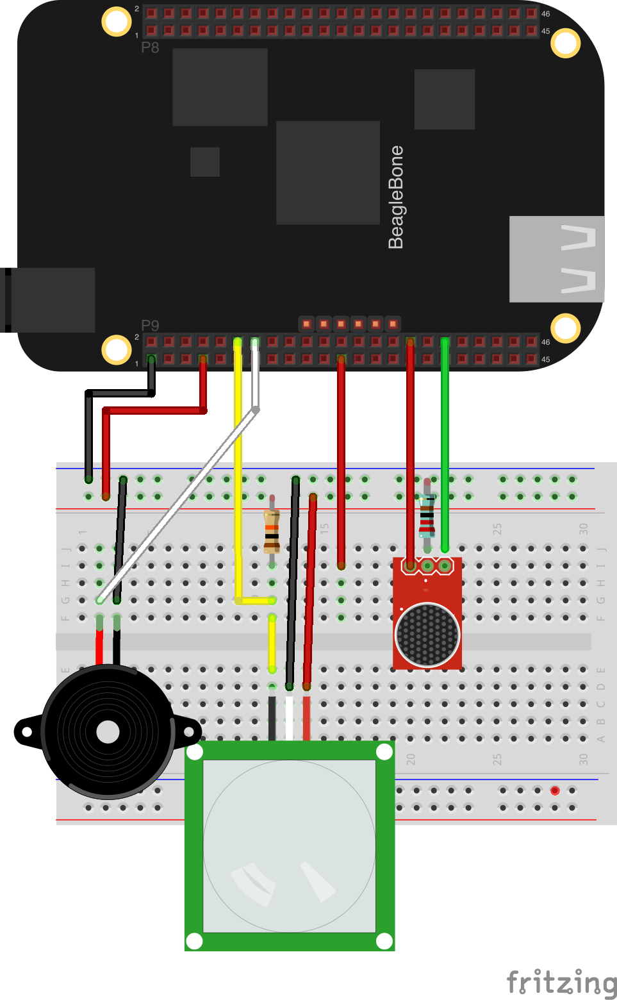

#The Microphone sensor

Next up is our microphone sensor. This will detect sound of possible intruders, and serve as another characterisitic that
we can use to trigger our alarm. This section you'll learn about streaming sensor data values, and taking advantage of
those readings in your Zetta app.

##Contents

1. Circuit
2. Retrieving Driver
3. Adding code to Server
4. Adding to your app
5. API and Browser

###Circuit

Here is a simple fritzing diagram of what your circuit will look like on the BeagleBone Black.



###Retrieving Driver

Again we'll use the npm command to install our driver. Type `npm install zetta-microphone-bonescript-driver --save`. This will install our driver for us.


**TIP**: Ensure you install while on the BeagleBone operating system. The package
installation will fail if you use your native OS.

**TIP**: Every module you'll use in this tutorial is open source. This one can be found here https://github.com/zettajs/zetta-microphone-bonescript-driver.

###Adding code to Server

Now it's time to actually wire up our Zetta driver into the server node.

```javascript
var zetta = require('zetta');
var Buzzer = require('zetta-buzzer-bonescript-driver');
var Microphone = require('zetta-microphone-bonescript-driver');

zetta()
  .use(Buzzer)
  .use(Microphone)
  .listen(1337)
```

* Here we've updated our code to let Zetta know that we want to use our Microphone sensor to detect sound.

###Creating your first app

Next we'll want to wire up interactions in Zetta. This is done with apps. Apps are just simple code snippets that wait for devices to come online.
After devices come online we then orchestrate interactions between devices.


```javascript
module.exports = function(server) {
  var buzzerQuery = server.where({type: 'buzzer'});
  var microphoneQuery = server.where({type: 'microphone'});

  server.observe([buzzerQuery, microphoneQuery], function(buzzer, pir, microphone){
    var microphoneReading = 0;

    microphone.streams.volume.on('data', function(msg){
      if (msg.data > 10) {
        buzzer.call('turn-on', function() {});
      } else {
        buzzer.call('turn-off', function() {});
      }
    });

  });
}
```

* The first line is an export statement in node. This is so that we can keep our apps modular and separated from the rest of our code.
  * The `server` variable is an instance of Zetta. We can use functionality attached to it to search for devices.
* The second line is where we create our first query. Zetta uses query to look for devices, or wait for devices to come online that fill all the parameters given.
  * This particular query tells Zetta to retrieve the buzzer for us
* The third line is a query for our Microphone sensor.
* The fourth line is a call to the function `observe`. Zetta waits for devices that fit queries given in the first argument to come online, and then fires the callback.
  * We want the callback function to fire when `"buzzer"` and `"microphone"` devices come online.
  * The function passes in the state machines of the devices in as individual arguments.
* The fifth line listens for a `"data"` event to happen on a `"volume"` stream
* The sixth line will call the `"beep"` transition on the buzzer. If the data value is above `10`

After you write this code you need to make sure the app is included in your server file. Update your server to look like so.

```javascript
var zetta = require('zetta');
var Buzzer = require('zetta-buzzer-bonescript-driver');
var Microphone = require('zetta-microphone-bonescript-driver');

var app = require('./apps/app');

zetta()
  .use(Buzzer)
  .use(Microphone)
  .load(app)
  .listen(1337)
```

The `load` function lets Zetta know that we have a particular app we want it to use. Run your code, and you should have an interaction happening when your sensor detects motion!


###API and Browser

Below is a sample API response for our microphone.

```json
{
  "class": [
    "device"
  ],
  "properties": {
    "id": "5637ad21-9530-49f3-a819-14ccd12904ae",
    "pin": "P9_36",
    "type": "microphone",
    "name": "Microphone",
    "volume": 1.055
  },
  "actions": null,
  "links": [
    {
      "rel": [
        "self"
      ],
      "href": "http://zetta-cloud-2.herokuapp.com/servers/38f645ed-73da-4742-8f20-c46317a48c19/devices/5637ad21-9530-49f3-a819-14ccd12904ae"
    },
    {
      "title": "beaglebone",
      "rel": [
        "up",
        "http://rels.zettajs.io/server"
      ],
      "href": "http://zetta-cloud-2.herokuapp.com/servers/38f645ed-73da-4742-8f20-c46317a48c19"
    },
    {
      "title": "volume",
      "rel": [
        "monitor",
        "http://rels.zettajs.io/object-stream"
      ],
      "href": "ws://zetta-cloud-2.herokuapp.com/servers/38f645ed-73da-4742-8f20-c46317a48c19/events?topic=microphone%2F5637ad21-9530-49f3-a819-14ccd12904ae%2Fvolume"
    },
    {
      "title": "logs",
      "rel": [
        "monitor",
        "http://rels.zettajs.io/object-stream"
      ],
      "href": "ws://zetta-cloud-2.herokuapp.com/servers/38f645ed-73da-4742-8f20-c46317a48c19/events?topic=microphone%2F5637ad21-9530-49f3-a819-14ccd12904ae%2Flogs"
    }
  ]
}

```

* The important difference between the device, and the others we've already used is that we include a link to monitor sensor readings over websockets.
  * Zetta makes it easy to get real time sensor readings quickly
